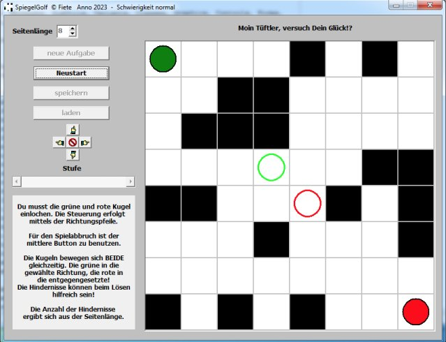

# Spiegellabyrinth

Du musst die grüne und rote Kugel in der Spielfeldmitte einlochen.
Die Steuerung erfolgt mittels der Buttons mit den Richtungspfeilen oder mit den Pfeiltasten auf der Tastatur.

Für den Spielabbruch ist der mittlere Button zu benutzen.

Die Kugeln bewegen sich BEIDE gleichzeitig. Die grüne in die gewählte Richtung, die rote in die entgegengesetzte!
Die Hindernisse können beim Lösen hilfreich sein!

Die Anzahl der Hindernisse ergibt sich aus der Seitenlänge.

[Quelltext inkl. kompilierter Anwendung](https://raw.githubusercontent.com/jaenicke/fiete/main/Spiegellabyrinth/SpiegelGolf.zip)